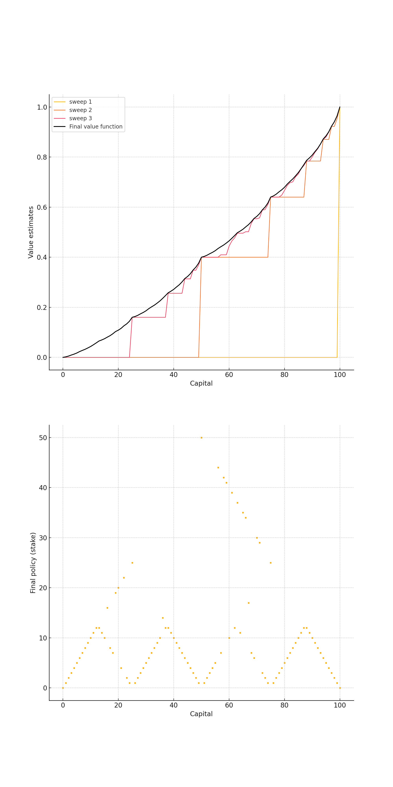

# TT-261-RL

### Gambler’s Problem – Value Iteration Solution ###

This project implements a solution to the Gambler’s Problem as described in Sutton & Barto's *Reinforcement Learning: An Introduction* (Example 4.3).

## 📌 Problem Description

A gambler makes bets on coin flips with a goal of reaching \$100 before losing everything. On each flip:

- If heads, the gambler wins the stake.
- If tails, the gambler loses the stake.

The gambler must choose how much to bet at each step, based on current capital. The aim is to maximize the probability of reaching \$100.

The environment is modeled as an **undiscounted episodic MDP**:
- **States**: Capital values from 1 to 99
- **Actions**: Stakes from \$1 to `min(s, 100 - s)`
- **Rewards**: 1 for reaching \$100, 0 otherwise
- **Transition probability**: Depends on coin flip (with heads probability `p_h = 0.4`)

## 📈 Value Iteration

We apply **Value Iteration** to find:
- The **optimal state-value function** (probability of winning from each capital)
- The **final optimal policy** (stake to bet at each capital)

We iterate until the value function converges to a stable solution (change < `1e-9`).

## 🧾 Files

- `notebooks/gamblers_problem.ipynb`: Jupyter notebook with full implementation.
- `book_images/Figure_4_3.PNG`: Reference figure from the book.
- `generated_images/figure_4_3.png`: Generated value function and policy plot from this implementation.

## 📊 Output

The upper plot shows value function estimates after a few selected sweeps (1, 2, 3, and 32), along with the final value function.

The lower plot shows the final optimal policy: the amount to stake at each capital level.

<p align="center">
  
</p>

## 🚀 How to Run

You can run the notebook using:

```bash
jupyter notebook notebooks/gamblers_problem.ipynb
